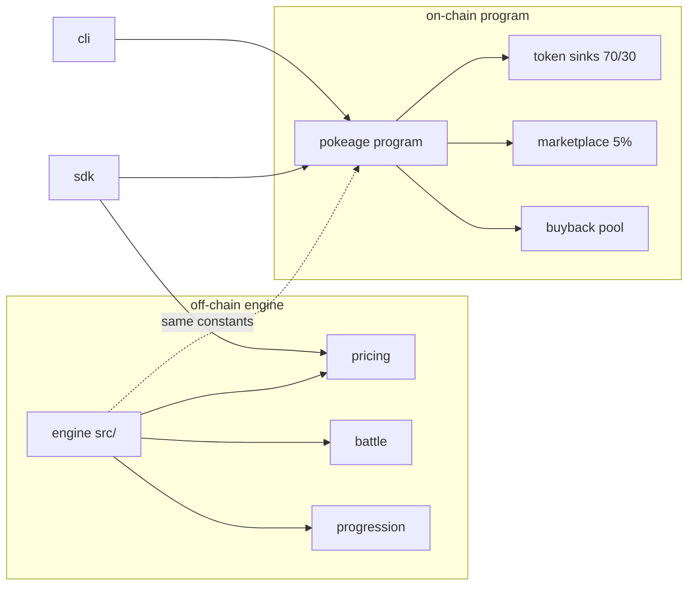

<p align="center">
  
</p>

<p align="center">
  <a href="LICENSE"></a>
  <a href="https://github.com/Pokeage/pokeage/actions/workflows/ci.yml"></a>
  
  
</p>

<p align="center">
  
  
  
  <a href="https://github.com/Pokeage/pokeage/stargazers"></a>
  <a href="https://github.com/Pokeage/pokeage/commits/main"></a>
  <a href="https://github.com/Pokeage/pokeage/issues"></a>
</p>

# pokeAge

A deterministic, dependency-free monster-RPG simulation engine in TypeScript,
paired with a planned `$PAGE` on-chain economy on Solana (Anchor, Token-2022).
The engine resolves battles, leveling, evolution, catching, and offline
progression; the on-chain program settles the value side: token sinks, NFT mint
gating, a marketplace, and a fail-closed buyback pool.

The original work lives in `src/` (engine) and `sdk/`. `lib/` style third-party
code is not vendored: the on-chain crate pulls dependencies through Cargo and
Anchor, not by copying sources.

## Features

| Area | What | Status |
| --- | --- | --- |
| Type chart | 17 types, super-effective, resist, immunity | stable |
| Damage | standard formula with STAB, crit, per-hit cap | stable |
| Progression | xp curve, stat growth, evolution gating | stable |
| Encounters | rare and legendary spawn odds, shop buffs | stable |
| Battle | 1v1 with event log, gym chains, auto sim | stable |
| Catching | rarity rates, level penalty, ball multipliers | stable |
| Offline | deterministic catch-up, capped at 24h | stable |
| Pricing | tier base, level band, evolution stage | stable |
| `$PAGE` program | sinks, mint gating, market, buyback pool | beta |
| SDK | PDAs, account decode, Token-2022 balances | beta |
| CLI | config, stats, pool, player, listing, sim | beta |

## Architecture

The off-chain engine decides outcomes. The on-chain program settles value. They
share one price model so estimates match charges.



A player action resolves in the engine (win a battle, evolve, reach the affection
cap), then the matching on-chain instruction settles it: burn a sink, mint a
card, list or buy on the market, or instant-sell into the pool. The engine takes
a seeded RNG, so a given seed reproduces the exact same run, which is what makes
the simulation testable.

See [docs/ARCHITECTURE.md](docs/ARCHITECTURE.md) for the full picture.

## Build

Clone with submodules, then build each piece.

```bash
git clone --recurse-submodules https://github.com/Pokeage/pokeage.git
cd pokeage

# engine + sdk (typescript)
npm install
npm run build
npm test

# cli (rust)
cargo build --release -p pokeage-cli

# on-chain program (anchor + sbf toolchain)
anchor build
```

## Quick start

Run a deterministic playthrough from the engine:

```ts
import { Engine, newTrainer, sampleRegistry, WORLD, Rng } from '@pokeage/engine';

const trainer = newTrainer('p1', 'ASH', sampleRegistry, { starterId: 4, balls: 30 });
const engine = new Engine(trainer, WORLD, (id) => sampleRegistry.getMonsterById(id), {
  rng: new Rng(2024),
});

for (let i = 0; i < 2000; i++) engine.tick();
console.log(trainer.badges.length, trainer.totalCaught);
// 12 8   (same seed always yields the same result)
```

Read on-chain state with the SDK:

```ts
import { PokeageClient } from '@pokeage/sdk';

const client = PokeageClient.fromRpc('https://api.devnet.solana.com');
const pool = await client.fetchPool();
// { totalLamports, floorPrice, instantSellEnabled } or null
```

Inspect the economy from the CLI:

```bash
pokeage config                 # program id, PDAs, economy constants
pokeage sim --days 30 --users 1000   # project daily burn and pool accrual
```

## Project structure

```
src/                 deterministic engine (zero runtime deps)
  typechart.ts       getTypeMultiplier, effectivenessLabel
  damage.ts          calcDamage, calcDamageSimple
  progression.ts     getXpForLevel, grantXp, wildXpReward
  encounter.ts       generateWildMonster
  battle.ts          simulateBattle, simulateAuto, simulateGym
  catch.ts           catchRate, attemptCatch
  engine.ts          Engine: tick orchestrator
  pricing.ts         cardPriceSol, mintFeeLamports, instantSellQuote
  data/              sample roster + 12-town world
sdk/                 client: pda, accounts, token, instructions, client
programs/pokeage/       anchor program
  instructions/      initialize, deploy_agent, catch_attempt, gym_challenge,
                     force_evolve, mint_card, list_card, cancel_listing,
                     buy_card, instant_sell, update_floor, withdraw_treasury
  state/             config, player, listing, pool, card
  idl/pokeage.json      generated IDL
cli/                 pokeage operator cli (clap)
tests/               engine tests (deterministic)
examples/            runnable scripts
docs/                architecture, engine, program, tokenomics, security
```

## Economy at a glance

| Sink | Cost ($PAGE) | Split |
| --- | --- | --- |
| Deploy agent | 1,000 | 70 burn / 30 pool |
| Catch (common / rare / legendary) | 10 / 100 / 1,000 | 70 burn / 30 pool |
| Gym challenge | 50 | 70 burn / 30 pool |
| Force evolve | 75,000 | 70 burn / 30 pool |

Marketplace charges a 5 percent trade fee (60 percent to the pool, 40 percent
burned). NFT mint fees scale by tier from 0.001 to 1.0 SOL. Instant sell pays
floor times 50 percent and is fail-closed when the pool is empty.
See [docs/tokenomics.md](docs/tokenomics.md).

## Contributing

See [CONTRIBUTING.md](CONTRIBUTING.md). Issues and pull requests use the
templates in `.github/`. Security reports go through [SECURITY.md](SECURITY.md).

## Status

Early stage, single author, no external audit. The Anchor program is
pre-deployment and its program id is a placeholder until launch. `$PAGE` is not
live yet, so the SDK takes the mint as a parameter.

## Links

- GitHub: [Pokeage/pokeage](https://github.com/Pokeage/pokeage)
- Docs: [docs/](docs/)
- Ticker: `$PAGE`

## License

[MIT](LICENSE)
