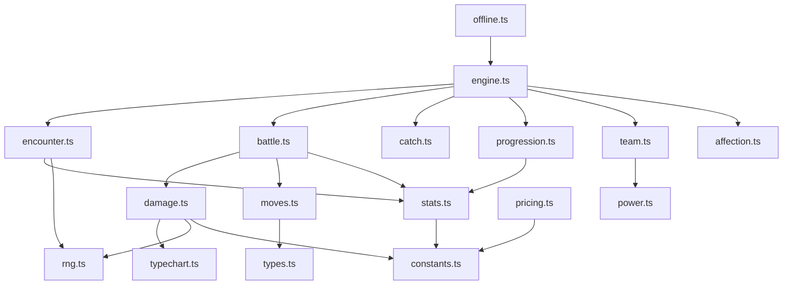

# pokeAge architecture

pokeAge is a monster-RPG that splits cleanly into two halves: a deterministic
simulation engine that decides what happens in the game, and an on-chain economy
that settles the value of those outcomes in $PAGE and SOL. The two halves never
share mutable state. The engine resolves a fight, a catch, or a level-up; the
chain only sees the result of a player action and moves tokens accordingly.

This document covers the monorepo layout, the off-chain / on-chain split, the
data flow between them, the determinism model, and how the four packages relate.

## Goals and non-goals

The engine is framework-free and pure. No DOM, no network, no globals, no wall
clock. Every random draw comes from an injected `Rng`, so a run is reproducible
from a single seed. That makes the balance testable and lets offline progression
replay the exact ticks a player missed.

The program is intentionally small. It runs token sinks, card mint fees, and a
SOL card marketplace with a fail-closed instant-sell floor. It does not run
combat, leveling, or encounter logic on-chain. Game outcomes are computed off-
chain by the engine; the chain charges and settles.

## Monorepo layout

```
product/
  src/                 engine: deterministic TypeScript simulation (the IP)
    data/              sample roster and world data
  programs/pokeage/       program: Solana Anchor economy in Rust (pre-deployment)
    src/instructions/  one handler module per instruction
    src/state/         account structs
    idl/pokeage.json      generated IDL
  sdk/                 TypeScript SDK: PDAs, borsh codec, token reads
  cli/                 Rust CLI: read-only operator views and projections
  docs/                this documentation
```

The engine source modules are: [types](../src/types.ts),
[rng](../src/rng.ts), [constants](../src/constants.ts),
[typechart](../src/typechart.ts), [moves](../src/moves.ts),
[damage](../src/damage.ts), [stats](../src/stats.ts),
[progression](../src/progression.ts), [power](../src/power.ts),
[catch](../src/catch.ts), [affection](../src/affection.ts),
[encounter](../src/encounter.ts), [battle](../src/battle.ts),
[team](../src/team.ts), [offline](../src/offline.ts),
[engine](../src/engine.ts), [pricing](../src/pricing.ts),
[factory](../src/factory.ts). The public surface is re-exported from
[index.ts](../src/index.ts).

## The off-chain / on-chain split

The engine owns simulation. Given a trainer, a world, and a seed, it decides
the next action and mutates the trainer in memory. It has no concept of a wallet,
a token balance, or a transaction. It produces structured results
(`TickResult`, `BattleResult`, `EncounterResult`) that a host can render, store,
or use to drive a transaction.

The program owns value. It holds `Config`, per-player `PlayerState`, the
`BuybackPool`, marketplace `Listing` accounts, and `CardMeta` records. It charges
$PAGE sinks for game actions (deploy, catch, gym, force-evolve), charges SOL
mint fees for cards, and runs the marketplace. It never decides whether a catch
succeeded or a gym was cleared; the client asserts that and pays the matching
sink.

The two are kept consistent by sharing constants, not code. The engine's
[constants.ts](../src/constants.ts) economy block mirrors the program's
[constants.rs](../programs/pokeage/src/constants.rs): same decimals, same sink
costs, same 70/30 split, same mint-fee table. The off-chain price model in
[pricing.ts](../src/pricing.ts) produces estimates that match what the chain
will charge, so a UI can quote a mint fee or an instant-sell payout before the
user signs.

## Module graph



`types.ts` and `constants.ts` are leaves that everything else depends on. The
`engine.ts` tick orchestrator sits on top and pulls in encounter, battle, catch,
progression, team, and affection. `offline.ts` is a thin wrapper that replays
engine ticks. `pricing.ts` is independent of the simulation and depends only on
the shared economy constants.

## Data flow: action to settlement

A single player action moves through three stages. The engine decides the
outcome, the host turns the outcome into a transaction, and the program settles
the value.

1. The host calls `engine.tick()` (or a specific helper such as
   `simulateBattle`). The engine draws from the injected `Rng`, resolves the
   outcome, mutates the trainer, and returns a `TickResult`.
2. If the outcome carries an on-chain cost (a catch attempt, a gym clear, a
   force-evolve, a card mint or trade), the host builds the matching instruction
   using the [SDK](../sdk/src/constants.ts): derive PDAs, encode args with the
   borsh codec, attach the player's token accounts.
3. The program charges the sink or fee, splits it, updates counters, and emits
   an event. Token sinks burn 70 percent and route 30 percent to the buyback
   pool. Card mint fees split 50/50 pool/treasury. Marketplace trades take a
   5 percent fee split 60 pool / 40 burn-share.

```mermaid
graph LR
  player[player action] --> engine[engine resolves outcome]
  engine --> outcome{has on-chain cost?}
